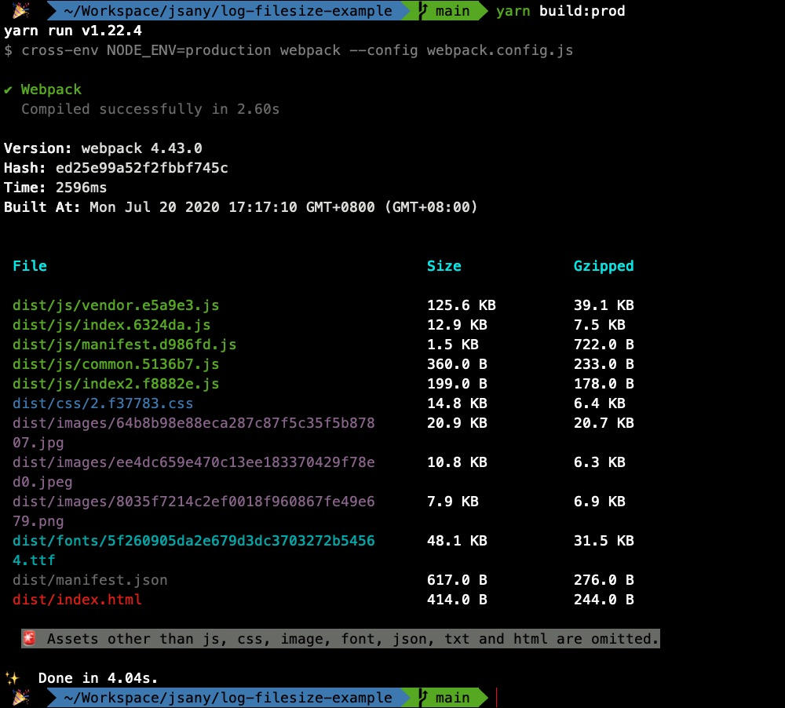

<h1 align="center">Welcome to log-filesize-webpack-plugin 👋</h1>
<p>
  
  
  
  <a href="https://github.com/jsany/log-filesize-webpack-plugin#readme" target="_blank">
    
  </a>
  <a href="https://github.com/jsany/log-filesize-webpack-plugin/graphs/commit-activity" target="_blank">
    
  </a>
  <a href="https://github.com/jsany/log-filesize-webpack-plugin/blob/master/LICENSE" target="_blank">
    
  </a>
</p>

> log assets size after webpack build(wirte by typescript)

### 🏠 [Homepage](https://github.com/jsany/log-filesize-webpack-plugin#readme)

### ✨ [Demo](https://github.com/jsany/log-filesize-webpack-plugin/blob/main/example/webpack.config.js)



## Prerequisites

- node >=8.10.0
- webpack >=4

## Install

```sh
yarn add -D @jsany/log-filesize-webpack-plugin
```

## Setup

In `webpack.config.js`:

```js
const LogFilesizeWebpackPlugin = require('@jsany/log-filesize-webpack-plugin');

module.exports = {

  stats: 'errors-only', // to close webpack print
  // ...
  plugins: [
    new LogFilesizeWebpackPlugin()
    // or
    // new LogFilesizeWebpackPlugin({gzip: true,...OtherOptions})
  ]
  // ...
}
```

## Options

| Options    | Type    | Default             | Description                                                         |
| ---------- | ------- | ------------------- | ------------------------------------------------------------------- |
| `gzip`     | boolean | `true`              | Print gzipped filesize                                              |
| `errors`   | boolean | `true`              | Print compile errors                                                |
| `warnings` | boolean | `true`              | Print compile warnings                                              |
| `hash`     | boolean | `true`              | Print current compile hash                                          |
| `version`  | boolean | `true`              | Print current webpack version                                       |
| `time`     | boolean | `true`              | Print compile cost time                                             |
| `builtAt`  | boolean | `true`              | Print when to start compiling                                       |
| `maxSize`  | number  | `1.8 * 1024 * 1024` | These sizes are pretty large. We'll warn for bundles exceeding them |

## Todo

- [ ] Images and other types of assets

## Author

👤 **jiangzhiguo2010**

- Website: <https://github.com/Mr-jiangzhiguo/book>
- Github: [@jsany](https://github.com/jsany)

## 🤝 Contributing

Contributions, issues and feature requests are welcome!<br />Feel free to check [issues page](https://github.com/jsany/log-filesize-webpack-plugin/issues). You can also take a look at the [contributing guide](https://github.com/jsany/log-filesize-webpack-plugin/blob/master/CONTRIBUTING.md).

## Show your support

Give a ⭐️ if this project helped you!

## 📝 License

Copyright © 2020 [jiangzhiguo2010](https://github.com/jsany).<br />
This project is [MIT](https://github.com/jsany/log-filesize-webpack-plugin/blob/master/LICENSE) licensed.
